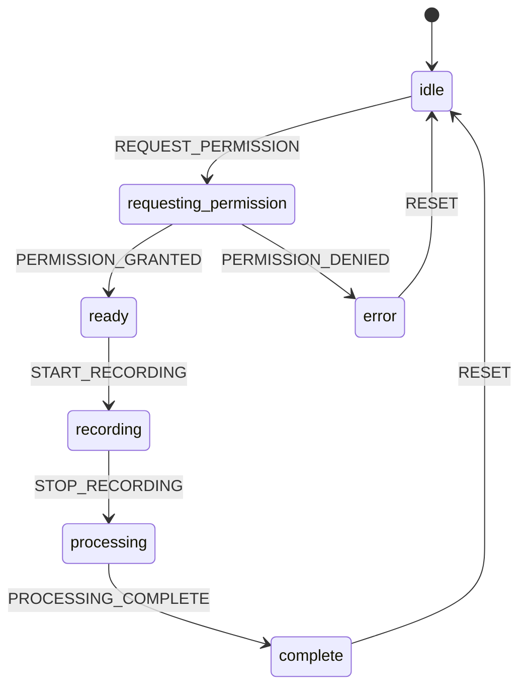

# Interview Simulator Design System (v2)

This document describes the v2 UI implementation using React 19, Vite, TailwindCSS v4, and shadcn/ui-style components.

## Overview

- **Stack**: React 19 + Vite + TailwindCSS v4 + shadcn/ui (Radix primitives)
- **Architecture**: Component-based with mobile-first responsive design
- **Theme**: Dark mode (CSS variables)
- **Typography**: Outfit (headings), Inter (body), JetBrains Mono (mono)

---

## Brand Colors (CodeSwiftr)

The design system uses CodeSwiftr brand colors via CSS variables:

```css
/* Brand Colors */
--electric-blue: 197 91% 60%;  /* #38BDF8 - Product CTAs, primary actions */
--brand-pink: 343 94% 70%;     /* #FF6B9D - Brand identity, success states */
--brand-accent: 188 100% 50%;  /* #00D9FF - Tech/AI elements */
```

### Usage Guidelines

- **Electric Blue**: Primary CTAs, interactive elements, focus states
- **Brand Pink**: Brand moments, achievements, success indicators
- **Brand Accent**: AI/tech indicators, futuristic UI elements

---

## CSS Variables (Theme System)

All theme values are defined as HSL in CSS variables for easy theming:

```css
:root {
  /* Brand Colors */
  --electric-blue: 197 91% 60%;
  --brand-pink: 343 94% 70%;
  --brand-accent: 188 100% 50%;
  
  /* Theme Colors (Dark) */
  --background: 220 15% 8%;
  --foreground: 210 40% 98%;
  --primary: var(--electric-blue);
  --primary-foreground: 220 15% 8%;
  --muted: 220 15% 16%;
  --muted-foreground: 213 31% 80%;
  --border: 220 15% 18%;
  --input: 220 15% 16%;
  --ring: var(--electric-blue);
}
```

**Location**: `src/styles.css`

**Color Space Note**: This design system uses HSL color space. OKLCH (a modern color space with better perceptual uniformity) is a future consideration but would require migrating all color values. HSL is chosen for its simplicity, wide support, and ease of understanding. See `vite-app/` reference implementation for an OKLCH-based approach.

---

## Typography

### Font Families

Configured in `tailwind.config.js`:

- **Headings**: `font-heading` → Outfit (system fallbacks)
- **Body**: `font-body` → Inter (system fallbacks)
- **Mono**: `font-mono` → JetBrains Mono, Fira Code (system fallbacks)

Fonts are loaded via Google Fonts in `index.html`.

### Type Scale

Tailwind's default type scale is used:
- `text-xs` (12px), `text-sm` (14px), `text-base` (16px)
- `text-lg` (18px), `text-xl` (20px), `text-2xl` (24px), `text-3xl` (30px)

---

## Component Inventory

### UI Primitives (`src/components/ui/`)

#### Button
**File**: `button.tsx`

Variants:
- `default` - Primary action (uses `--primary` color)
- `outline` - Secondary action with border
- `ghost` - Tertiary action, transparent background
- `subtle` - Muted background variant

Sizes:
- `sm`, `default`, `lg`, `icon`, `fab`

The `fab` size creates a Floating Action Button (56x56px, rounded-full) for thumb-zone placement.

#### Card
**File**: `card.tsx`

Composed of:
- `Card` - Container
- `CardHeader` - Header section
- `CardTitle` - Title (h3)
- `CardContent` - Main content area

Uses `bg-muted/40` with border for subtle elevation.

#### Input
**File**: `input.tsx`

Styled text input with focus ring using `--ring` color. Supports all standard input types and HTML input attributes.

#### Dialog
**File**: `dialog.tsx`

Modal dialog component built on Radix Dialog primitives. Use for confirmations, forms, and important interactions.

#### Drawer (Bottom Sheet)
**File**: `drawer.tsx`

Bottom sheet component built on Radix Dialog. Optimized for mobile interactions. Use for:
- Contextual actions
- Q&A panels (Preparation mentor)
- Settings panels (Voice preferences)
- Hints (Interview Room)

Components: `Drawer`, `DrawerTrigger`, `DrawerContent`, `DrawerHeader`, `DrawerTitle`, `DrawerDescription`

#### Progress
**File**: `progress.tsx`

Linear progress bar component. Props:
- `value` (number): Current value
- `max` (number, default 100): Maximum value

Displays as a horizontal bar with animated fill.

#### ScoreRing
**File**: `score-ring.tsx`

Circular score visualization with color-coded rings based on score ranges:
- 90-100: Emerald (excellent)
- 75-89: Green (good)
- 60-74: Yellow (average)
- 40-59: Orange (needs work)
- 0-39: Red (poor)

Props:
- `value` (number): Score value
- `max` (number, default 100)
- `label` (string, optional): Label below score
- `size`: `"sm"` (80px), `"md"` (120px), `"lg"` (160px)

Used in FeedbackPage for Overall, Content, and Delivery scores.

#### Switch
**File**: `switch.tsx`

Toggle switch component. Props:
- `checked` (boolean): Current state
- `onCheckedChange` (function): Callback when toggled

Used in SettingsPage for preferences.

#### Textarea
**File**: `textarea.tsx`

Styled textarea component with focus ring. Supports all standard textarea attributes. Used for multi-line text input.

Used in PreparationPage for draft answer input.

#### Select
**File**: `select.tsx`

Dropdown select component built on Radix UI Select primitives. Components:
- `Select` - Root component (replaces native `<select>`)
- `SelectTrigger` - The button that opens the dropdown
- `SelectValue` - Displays selected value
- `SelectContent` - Dropdown menu container
- `SelectItem` - Individual option
- `SelectLabel` - Optional group label
- `SelectSeparator` - Visual separator

Used in SettingsPage for voice and speech rate selection.

**Note**: Uses Radix UI for accessibility and mobile support. Portal-based rendering ensures proper z-index stacking.

#### Label
**File**: `label.tsx`

Styled label component for form inputs. Provides consistent typography and spacing. Supports peer-disabled styling for disabled inputs.

Used in SettingsPage for form field labels.

#### Badge
**File**: `badge.tsx`

Badge component for status indicators, categories, and tags. Variants:
- `default` - Primary color background
- `secondary` - Secondary color background
- `destructive` - Error/destructive color
- `outline` - Border only

Future use cases: Question categories, session status, score indicators.

---

## Layout Components

### AppShell
**File**: `src/shell/AppShell.tsx`

Main application layout wrapper. Provides:
- Header (sticky, top)
- Main content area (with max-width constraint)
- BottomNav (fixed, bottom)
- React Router integration

Routes:
- `/dashboard` - DashboardPage
- `/practice` - PreparationPage
- `/progress` - ProgressPage
- `/interview/:id` - InterviewPage
- `/feedback/:id` - FeedbackPage
- `/settings` - SettingsPage
- `/auth` - AuthPage

### BottomNav
**File**: `src/components/navigation/BottomNav.tsx`

Mobile-first bottom navigation bar. Fixed at bottom with:
- Home (dashboard)
- Practice
- Progress
- Settings

Uses `NavLink` from react-router-dom for active state styling.

---

## Pages/Views (`src/views/`)

### DashboardPage
- Welcome section
- Stats cards (Readiness score, This week)
- Recent sessions list
- FAB (Fixed Action Button) for "Start new practice"

### InterviewPage
- Question display (large, readable)
- Timer + progress bar (when recording)
- Recording controls (thumb-zone, bottom-center)
- Mentor hints (Drawer/bottom sheet)
- Full-screen focus mode when recording

### PreparationPage
- Mentor Q&A (Drawer)
- Question display
- Draft textarea
- Voice controls (fixed bottom bar, thumb-zone)

### FeedbackPage
- Swipeable score cards with ScoreRing components
- Progressive disclosure (details/summary) for strengths/improvements
- Fixed bottom CTA ("Practice Again")

### ProgressPage
- Stats cards (Average score, Total sessions)
- Session history list

### SettingsPage
- Account section (email, notifications toggle)
- Voice preferences (toggles, Drawer for detailed settings)
- Appearance section

### AuthPage
- Sign in form (email, password inputs)
- Primary CTA button

---

## State Management

### useInterviewStateMachine
**File**: `src/hooks/useInterviewStateMachine.ts`

React hook using `useReducer` to manage interview recording flow.

**States**:
- `idle` - Initial state
- `requesting_permission` - Requesting microphone permission
- `ready` - Permission granted, ready to record
- `recording` - Actively recording
- `processing` - Processing audio
- `complete` - Session complete
- `error` - Error occurred

**Actions**:
- `requestPermission()` - Request mic permission
- `grantPermission()` - Grant permission (called after getUserMedia succeeds)
- `denyPermission()` - Deny permission
- `startRecording()` - Start recording
- `stopRecording()` - Stop recording
- `completeProcessing()` - Mark processing complete
- `reset()` - Reset to idle
- `setError(error)` - Set error state

**Returned values**:
- `state` - Current state
- `error` - Error message (if any)
- `canRecord`, `canStop`, `canReset` - Boolean flags for UI control

**State Machine Diagram**:



---

## Mobile Interaction Patterns

### Bottom Sheet (Drawer)
Used for contextual actions that don't require full-screen focus:
- Mentor Q&A in PreparationPage
- Mentor hints in InterviewPage
- Voice settings in SettingsPage

### FAB (Floating Action Button)
Fixed-position circular button in thumb-zone (bottom-right). Used for primary actions:
- "Start new practice" on DashboardPage

### Thumb-Zone Controls
Critical controls placed in bottom-center area (easy thumb reach):
- Recording start/stop buttons (InterviewPage)
- Voice controls bar (PreparationPage)

### Full-Screen Focus Mode
When recording (InterviewPage), the UI enters full-screen focus:
- Hides navigation
- Timer/progress bar fixed at top
- Recording controls in thumb-zone

### Progressive Disclosure
Expandable sections using HTML `<details>`:
- Strengths/Improvements in FeedbackPage

---

## Utility Functions

### cn (className utility)
**File**: `src/lib/cn.ts`

Merges Tailwind classes using `clsx` and `tailwind-merge`. Ensures correct class precedence and deduplication.

```tsx
import { cn } from "../lib/cn";

<div className={cn("base-classes", condition && "conditional-classes")} />
```

---

## Responsive Breakpoints

Tailwind default breakpoints:
- `sm`: 640px (mobile landscape)
- `md`: 768px (tablets)
- `lg`: 1024px (small laptops)
- `xl`: 1280px (desktops)
- `2xl`: 1536px (large screens)

**Current implementation**: Mobile-first with desktop support via responsive classes.

---

## Accessibility

### Focus Management
- All interactive elements have visible focus states (`focus-visible:ring-2`)
- Focus ring uses `--ring` color (Electric Blue)

### ARIA
- Switch component uses `role="switch"` with `aria-checked`
- Select component uses Radix UI primitives with full ARIA support
- Button components properly labeled with `aria-label` where needed
- Label components properly associated with form inputs via `htmlFor`

### Touch Targets
- FAB buttons: 56x56px (≥44px WCAG recommendation)
- Bottom nav items: Adequate spacing for thumb navigation

### Color Contrast
- Text on background meets WCAG AA standards
- Score colors chosen for sufficient contrast

---

## Testing

### E2E Tests
**File**: `tests/e2e/mobile-flows.spec.ts`

Playwright tests covering:
- Navigation flows
- Bottom nav visibility
- Interview Room state machine
- Preparation bottom sheet
- Feedback score cards
- Dashboard FAB accessibility

**Viewport**: iPhone SE (375x667) for mobile-first testing

---

## File Structure

```
src/
├── components/
│   ├── ui/              # shadcn-style primitives
│   │   ├── badge.tsx
│   │   ├── button.tsx
│   │   ├── card.tsx
│   │   ├── dialog.tsx
│   │   ├── drawer.tsx
│   │   ├── input.tsx
│   │   ├── label.tsx
│   │   ├── progress.tsx
│   │   ├── score-ring.tsx
│   │   ├── select.tsx
│   │   ├── switch.tsx
│   │   └── textarea.tsx
│   └── navigation/
│       └── BottomNav.tsx
├── hooks/
│   └── useInterviewStateMachine.ts
├── lib/
│   └── cn.ts            # className utility
├── shell/
│   └── AppShell.tsx     # Main layout + routing
├── styles.css           # Global styles + CSS variables
└── views/               # Page components
    ├── AuthPage.tsx
    ├── DashboardPage.tsx
    ├── FeedbackPage.tsx
    ├── InterviewPage.tsx
    ├── PreparationPage.tsx
    ├── ProgressPage.tsx
    └── SettingsPage.tsx
```

---

## Future Enhancements

### Planned Components
- `Toast` - Notification system
- `Skeleton` - Loading states
- `Tabs` - Tab navigation
- `DropdownMenu` - Context menus
- `AlertDialog` - Confirmation dialogs

### Theme Support
- Dark mode toggle (currently dark-only)
- Light mode variant

### PWA Features
- Offline support (deferred)
- Install prompt (deferred)

---

## References

- [TailwindCSS v4 Documentation](https://tailwindcss.com)
- [shadcn/ui Components](https://ui.shadcn.com)
- [Radix UI Primitives](https://www.radix-ui.com)
- [Lucide Icons](https://lucide.dev)
