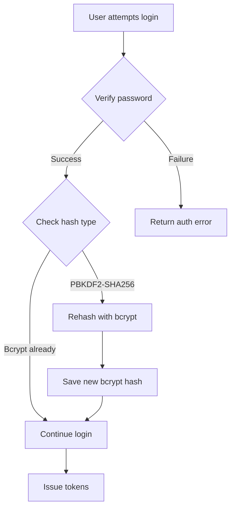

# Password Migration Guide: PBKDF2-SHA256 to Bcrypt

This document describes the security upgrade from PBKDF2-SHA256 to bcrypt password hashing, including the lazy migration strategy implemented for seamless user experience.

## Overview

The Interview Simulator has been upgraded to use bcrypt for password hashing, providing improved security with:
- Built-in salt to prevent rainbow table attacks
- Adaptive work factor (12 rounds) for increased resistance to brute force
- Proven track record in production systems

## Migration Strategy

### Lazy Migration

We implement a **lazy migration** approach to ensure zero downtime and seamless user experience:

1. **Backward Compatibility**: Existing PBKDF2-SHA256 hashes continue to work
2. **Transparent Migration**: Users are migrated to bcrypt during normal login
3. **No User Action Required**: Users don't need to change their passwords
4. **Gradual Transition**: Users are migrated individually as they log in

### Migration Flow



## Implementation Details

### Password Hashing Context

The `CryptContext` is configured to support both algorithms:

```python
pwd_context = CryptContext(
    schemes=["bcrypt", "pbkdf2_sha256"],
    deprecated="auto",
    bcrypt__rounds=12  # Higher rounds for better security
)
```

### Key Functions

#### `hash_password(password: str) -> str`
- Always uses bcrypt for new passwords
- Ensures all new accounts use the secure hashing method

#### `verify_password(plain: str, hashed: str) -> bool`
- Supports both bcrypt and legacy pbkdf2_sha256
- Transparently verifies regardless of hash type
- Includes error handling for security monitoring

#### `needs_rehash(hashed: str) -> bool`
- Detects if a password uses the legacy algorithm
- Returns `True` for pbkdf2_sha256 hashes
- Returns `False` for bcrypt hashes

#### `migrate_password_hash(password: str) -> str`
- Creates a new bcrypt hash from plaintext password
- Used after successful verification of legacy passwords

## Security Improvements

### Before: PBKDF2-SHA256
- Hash format: `$pbkdf2-sha256$[iterations]$[salt]$[hash]`
- Requires manual salt management
- Iterations need careful tuning

### After: Bcrypt
- Hash format: `$2b$[rounds]$[salt][hash]`
- Built-in 128-bit salt
- Adaptive work factor (12 rounds = ~200ms on modern hardware)
- Memory-hard function

### Security Comparison

| Feature | PBKDF2-SHA256 | Bcrypt |
|---------|---------------|--------|
| Salt Management | Manual | Built-in |
| GPU Resistance | Low | Medium |
| Memory Hardness | No | Yes (4KB) |
| Adaptive Cost | Yes | Yes |
| Industry Standard | Good | Excellent |

## Database Impact

### Schema Changes
No schema changes required. The `hashed_password` column stores both hash formats transparently.

### Migration Timeline
- **Phase 1** (Deployed): New passwords use bcrypt
- **Phase 2** (Ongoing): Legacy passwords migrated on login
- **Phase 3** (Future): Monitor migration progress
- **Phase 4** (Future): Remove pbkdf2 support when 99% migrated

### Monitoring Migration Progress

```sql
-- Count legacy passwords
SELECT COUNT(*)
FROM users
WHERE hashed_password LIKE '$pbkdf2-sha256$%';

-- Count bcrypt passwords
SELECT COUNT(*)
FROM users
WHERE hashed_password LIKE '$2b$%';
```

## Testing

### Unit Tests
- `tests/test_password_migration.py`: Tests all password functions
- Covers hash creation, verification, and migration logic

### Integration Tests
- `tests/test_login_migration.py`: Tests complete login flow
- Verifies transparent migration during authentication
- Tests edge cases and error conditions

### Security Tests
- Password verification with invalid hashes
- Wrong password attempts
- Migration idempotency
- Performance impact measurement

## Performance Considerations

### Bcrypt Cost Factor
- Current: 12 rounds (~200ms verification)
- Balanced security vs performance
- Can be increased as hardware improves

### Migration Performance
- No batch processing needed
- Individual migration during login
- Minimal impact on login time
- Database load spread over time

## Best Practices

### For Developers
1. **Always use** `hash_password()` for new passwords
2. **Check** `needs_rehash()` after successful login
3. **Call** `migrate_password_hash()` if needed
4. **Never** manually construct password hashes

### For Operations
1. **Monitor** migration progress weekly
2. **Track** failed login attempts
3. **Measure** login performance impact
4. **Plan** for bcrypt cost increases

## Security Audit Checklist

- [x] bcrypt uses 12+ rounds
- [x] All new passwords use bcrypt
- [x] Legacy passwords migrate on login
- [x] No passwords stored in plaintext
- [x] Password verification timing attack resistant
- [x] Migration error handling implemented
- [x] Comprehensive test coverage
- [x] Performance impact measured

## Troubleshooting

### Common Issues

#### "Invalid credentials" after migration
- Check password hash wasn't corrupted
- Verify migration completed successfully
- Review logs for errors

#### Slow login times
- Monitor bcrypt verification time
- Consider reducing rounds if >500ms
- Check database performance

#### Migration not happening
- Verify `needs_rehash()` logic
- Check if users are actually logging in
- Review login endpoint code

### Emergency Rollback
If issues arise, temporarily disable migration:
```python
# In security.py - EMERGENCY ONLY
pwd_context = CryptContext(schemes=["pbkdf2_sha256"], deprecated="auto")
```

## Future Improvements

1. **Argon2**: Consider upgrading to Argon2id (more secure, memory-harder)
2. **Hardware Security**: Add rate limiting and account lockout
3. **Password Policies**: Implement stronger password requirements
4. **Multi-factor**: Add TOTP/U2F support
5. **Passwordless**: Consider WebAuthn/passkey support

## References

- [OWASP Password Storage Cheat Sheet](https://cheatsheetseries.owasp.org/cheatsheets/Password_Storage_Cheat_Sheet.html)
- [Bcrypt Paper](https://www.usenix.org/legacy/event/usenix99/provos/provos.pdf)
- [Passlib Documentation](https://passlib.readthedocs.io/)